class: center, middle
第十章  
 Git and Tidy Codes  
版本控制与整洁的代码  
 
 
胡传鹏  
2023/05/08  

---
 
 
 
 
10.1 Git and GitHub
  
 
- 10.1.1 Download Git  
- 10.1.2 Sign up GitHub  
- 10.1.3 New repository  
- 10.1.4 Download GitHub Desktop  
- 10.1.5 GitHub Desktop: Clone repository  
- 10.1.6 Create README  
- 10.1.7 First Commit  

---
## <h1 lang="en">10.1.1 Download Git</h1> 
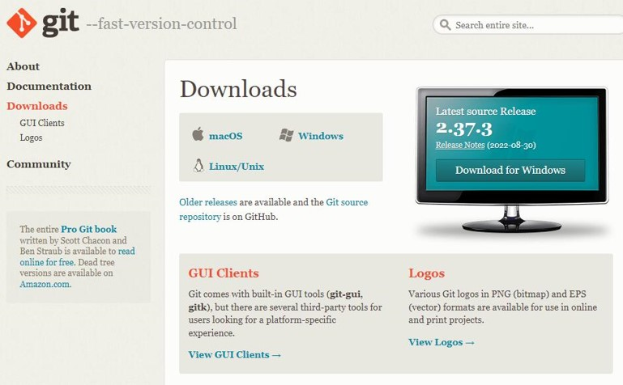  
Git是版本控制的工具，GitHub是存放你历史版本的平台  
首先，我们要下载Git https://git-scm.com/downloads  
~~(可能你直接安装GitHub Desktop也会自动安装Git)~~

---
## <h1 lang="en">10.1.2 Sign up GitHub</h1> 
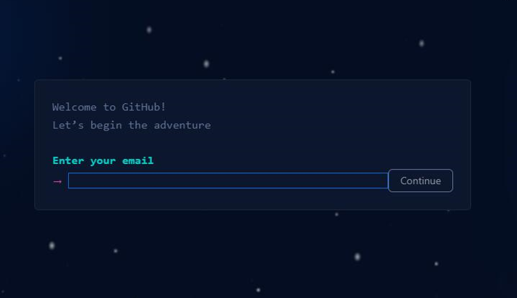  
注册一个GitHub账号 https://github.com  
~~推荐使用outlook, gmail, icloud, hotmail, yahoo等"你懂的"邮箱~~

---
## <h1 lang="en">10.1.3 New repository</h1> 
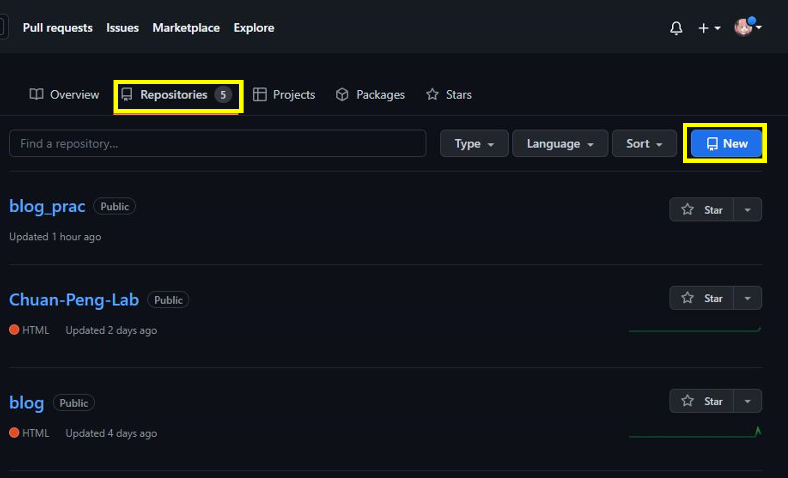  
在自己的用户界面找到repository，点击new  

---
## <h1 lang="en">10.1.3 New repository</h1> 
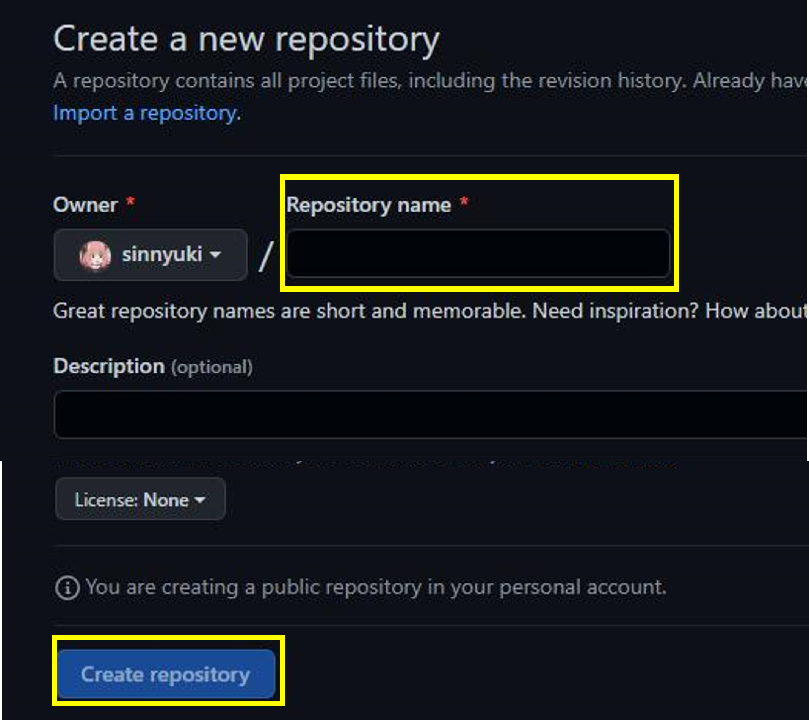  
设定一个repository的名字，然后点击create repository  

---
## <h1 lang="en">10.1.4 Download GitHub Desktop</h1> 
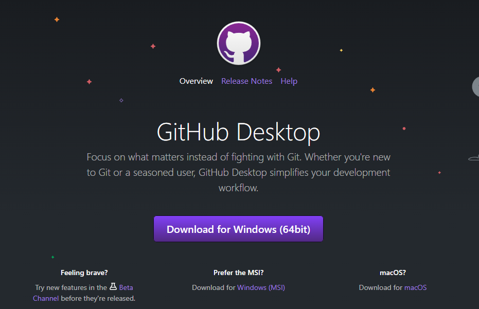  
下载安装 GitHub Desktop https://desktop.github.com/  

---
## <h1 lang="en">10.1.5 GitHub Desktop: Clone repository</h1> 
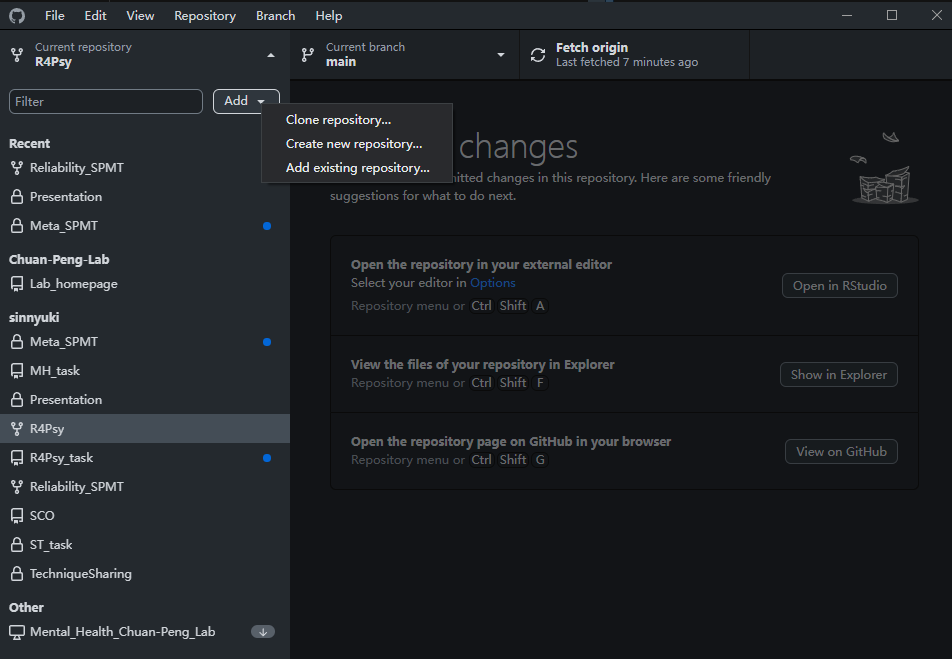  
打开GitHub Desktop，点击 Add -- Clone repository  

---
## <h1 lang="en">10.1.5 GitHub Desktop: Clone repository</h1> 
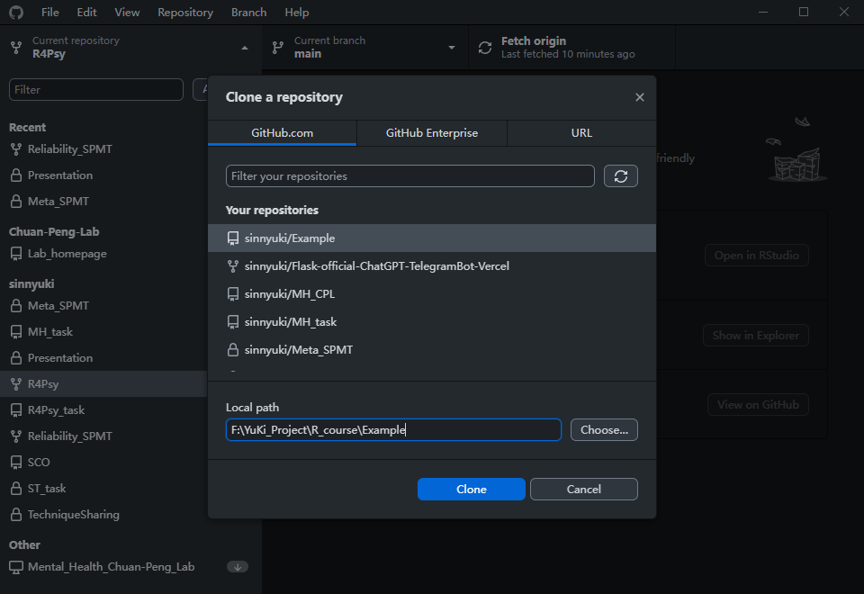  
选择你刚刚创建的repository  
设定你想保存的本地地址，点击clone   

---
## <h1 lang="en">10.1.5 GitHub Desktop: Clone repository</h1> 
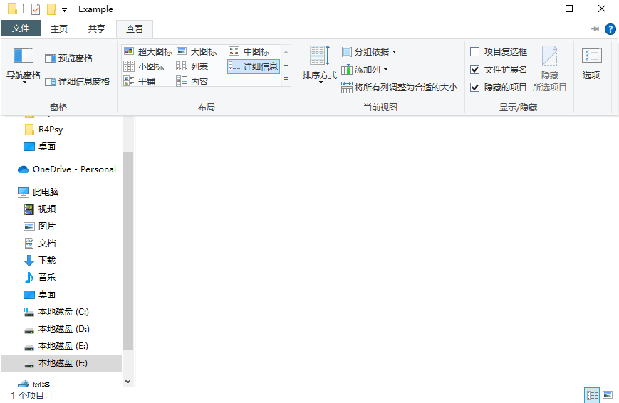  
点击"查看"，点击"显示隐藏的项目"  

---
## <h1 lang="en">10.1.5 GitHub Desktop: Clone repository</h1> 
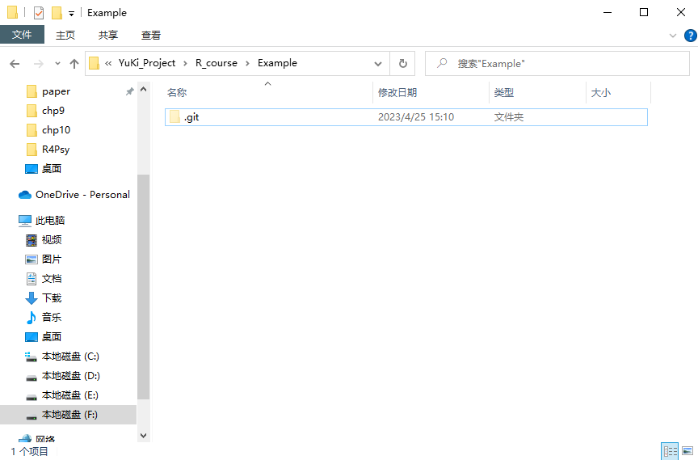  
可以看到一个半透明的git文件夹  
git文件夹内会记录你对Example这个文件夹的每一次修改  

---
## <h1 lang="en">10.1.6 Create README</h1> 
  
我们创建一个READEME  

---
## <h1 lang="en">10.1.7 First Commit</h1> 
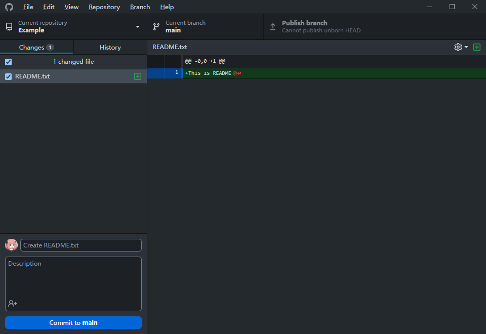  
 左下角，如果你只是更改了一个文件，GitHub Desktop会自动帮你命名(版本名)  
 你只需要写一个Description来描述你这一次做了些什么 
 写完后点击Commit to main  

---
## <h1 lang="en">10.1.7 First Commit</h1> 
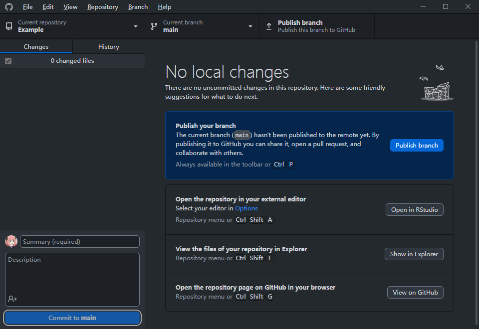  
点击右侧的publish_branch，上传到GitHub  
(如果是第二次写commit，这里会变成push origin)  

---
 
 
 
 
10.2 Tidy Code
  
 
- 10.2.1 Create a R project  
- 10.2.2 Create a R markdown  
- 10.2.3 Write Codes in Chunks  
- 10.2.4 Create Folders  
- 10.2.5 Create Lists for (df, out, p,...)  
- 10.2.6 Create README  
- 10.2.7 First Commit  

---
## <h1 lang="en">10.2.1 Create a R project</h1> 
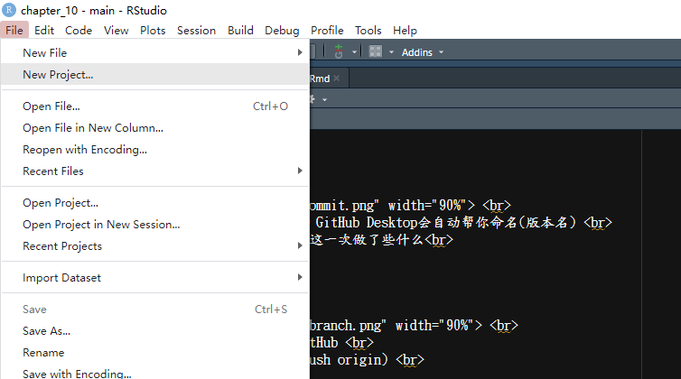  
如果你要做一个新的项目，创建一个R project  

---
## <h1 lang="en">10.2.1 Create a R project</h1> 
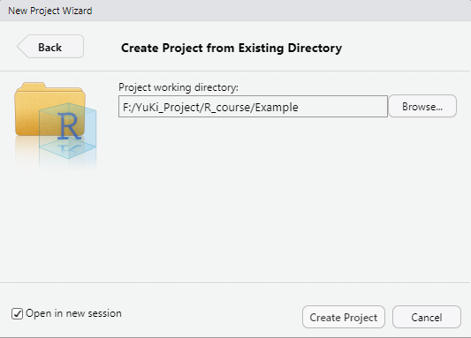  
设定路径为我们刚刚创建的git文件夹Example  

---
## <h1 lang="en">10.2.1 Create a R project</h1> 
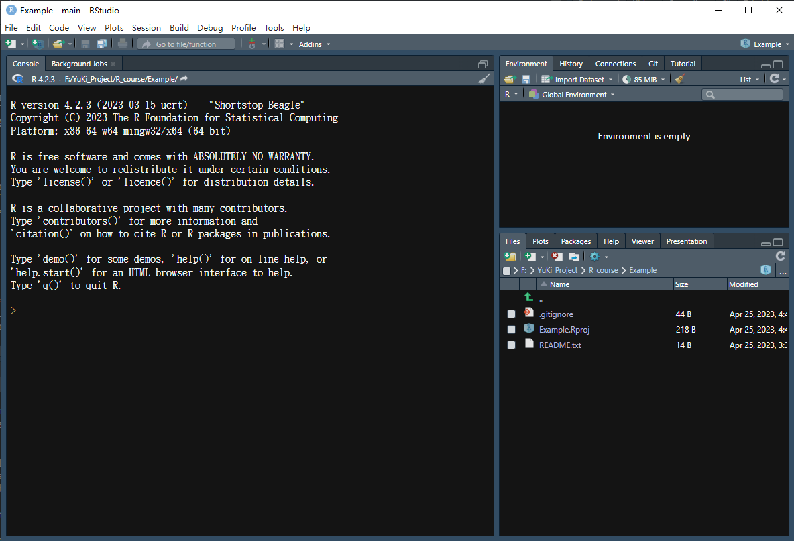  
创建完成后会打开一个新的R studio窗口  
(可以看到R studio识别到这是一个git文件夹，自动帮我们创建了R相关的.gitignore)  

---
## <h1 lang="en">10.2.2 Create a R markdown</h1> 
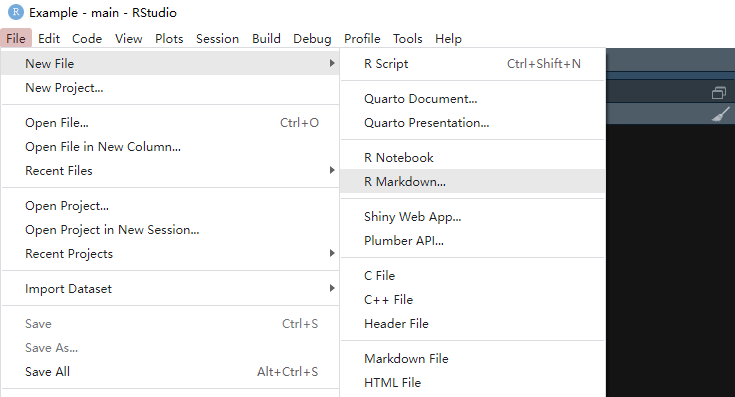  
创建一个rmarkdown用来写代码  
不要创建R script, 它没有Chunk，代码会很乱 

---
## <h1 lang="en">10.2.2 Create a R markdown</h1> 
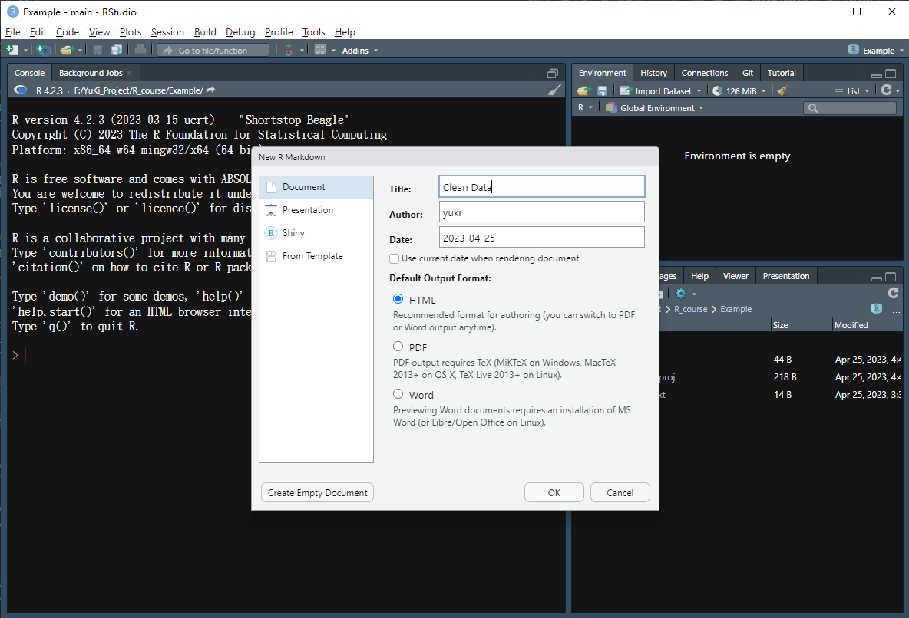  
给这个Rmarkdown取一个名字，最好使用驼峰式大小写 
~~(如果你没有强迫症，可以全部小写或全部大写)~~  

---
## <h1 lang="en">10.2.2 Create a R markdown</h1> 
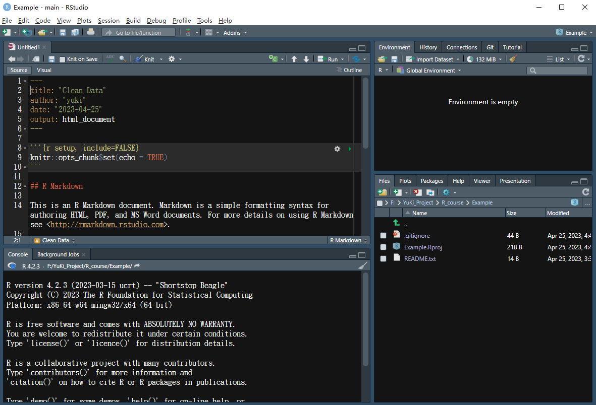  
这就算创建好了一个R markdown，会有默认的几行代码作为示例 

---
## <h1 lang="en">10.2.2 Create a R markdown</h1> 
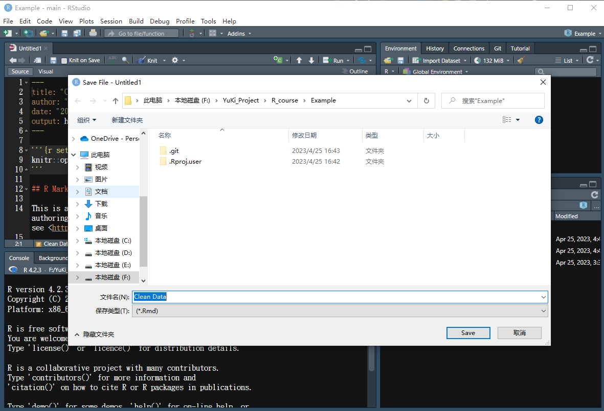  
保存这个R markdown，名字可以与之前的Title一致，也可以不一致 
~~强迫症一定会写一致~~  
你刚刚只是创建了这个R markdown，可以在右侧的Files看到，并没有rmd文件 

---
## <h1 lang="en">10.2.3 Write Codes in Chunks</h1> 
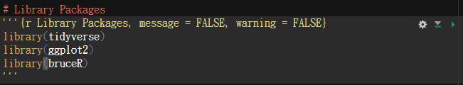  
一个Chunk由这样几部分组成 
1. 三个 "`" 数字键1左边的点，表示这个Chunk的开始 
2. 大括号 "{}" 字母键P右边，表示这个Chunk内的语言是什么语言 
3. 大括号内， ","逗号后的argument，比如warning = FALSE 意味着这段Chunk在运行后不会出现warning 
4. 三个 "`" 表示这个Chunk的结束 
5. 最右侧的绿色三角，表示运行这个Chunk
 
_- 一些强迫症的东西_ 
_a. 等号左右的空格_ 
_b. 逗号后面的空格_ 
_c. 赋值符号 " <- " 左右的空格_ 

---
## <h1 lang="en">10.2.4 Create Folders</h1> 
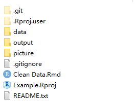  
创建两个文件夹，分别用来存放数据，结果和图片

---
## <h1 lang="en">10.2.5 Create Lists for (df, out, p,...)</h1> 
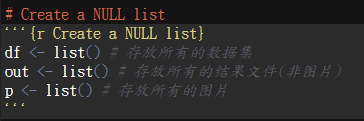  
创建三个list，分别存放所有的数据集，所有的结果文件，所有的图片  
对应刚才在根目录下创建的三个文件夹 
