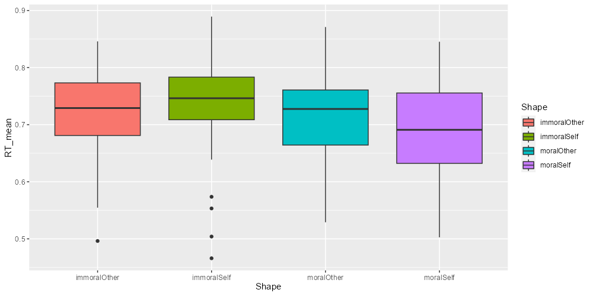
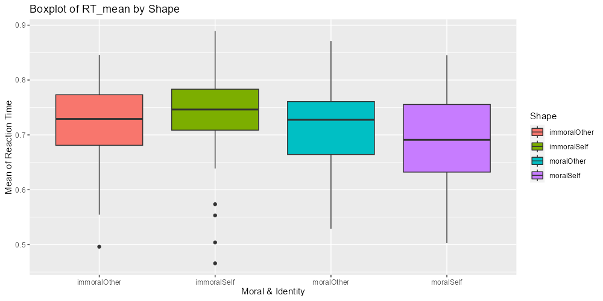
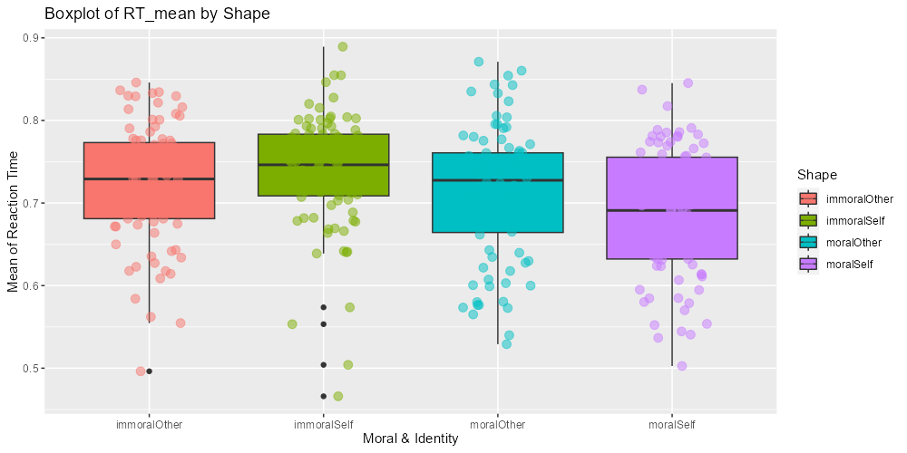
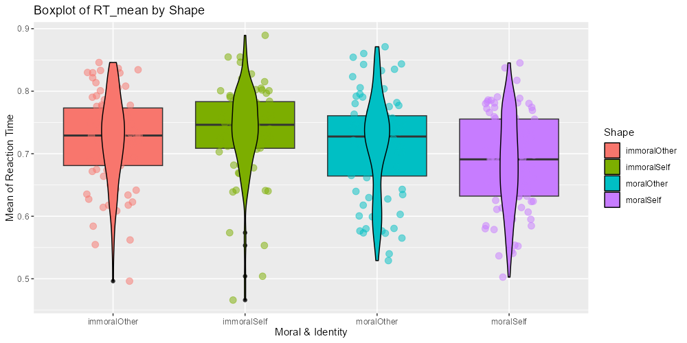
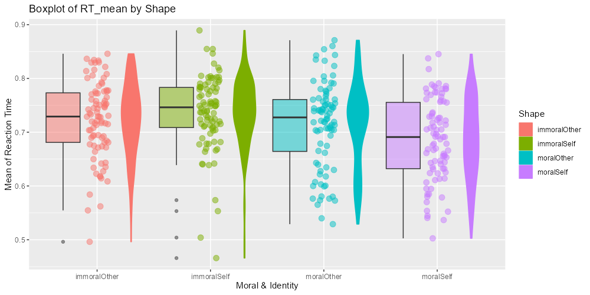
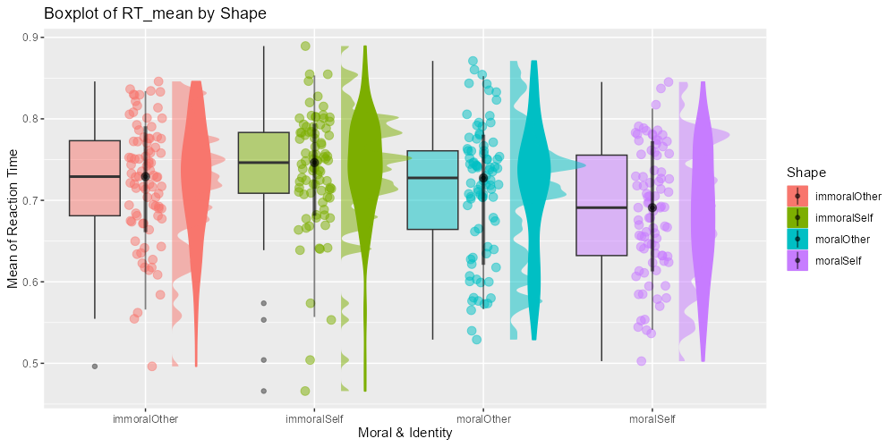
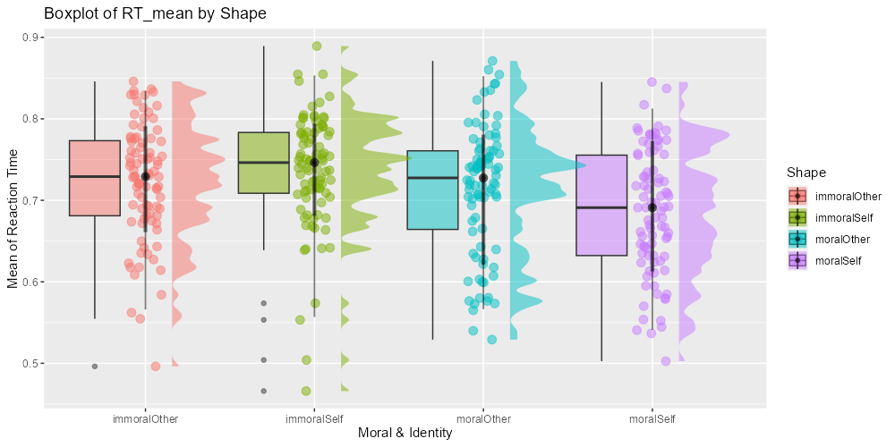

class: center, middle
<span style="font-size: 60px;">第十一章</span> <br>
<span style="font-size: 50px;">如何得到可发表的图像</span> <br>
<span style="font-size: 50px;">数据可视化进阶</span> <br>
<span style="font-size: 30px;">ggplot2</span> <br>
<br>
<br>
<span style="font-size: 30px;">胡传鹏</span> <br>
<span style="font-size: 30px;">2023/05/08</span> <br>

---
class: center, middle
<span style="font-size: 60px;">11.1 Layers and Facets</span> <br>
---
# <h1 lang="zh-CN">图层</h1>
# <h1 lang="en">Layers</h1>
<div style="display:flex; align-items:center;">
  
</div>
<br>
_<h4 lang="zh-CN">相信大家都用过PhotoShop，对图层这个概念一定已经非常熟悉了 </h4>_

---
# <h1 lang="zh-CN">图层</h1>
# <h1 lang="en">Layers</h1>
<div style="display:flex; align-items:center; justify-content:center;">
  
</div>
<br>
_<h4 lang="zh-CN">在ggplot2中，用 + 加号来表示一个个图层 </h4>_

---
# <h1 lang="zh-CN">图层</h1>
# <h1 lang="en">Layers</h1>
<div style="display:flex; align-items:center; justify-content:center;">
  
</div>
<br>
_<h4 lang="zh-CN">和PS类似，ggplot2也是通过修改每个图层的信息来美化图片 </h4>_

---
# <h1 lang="zh-CN">图层</h1>
# <h1 lang="en">Facets</h1>

<div style="display:flex; align-items:center; justify-content:center;">
  
</div>
<br>
_<h4 lang="zh-CN">Facet 也可以被认为是图层的一种，也是通过"+"加号叠加在原始图片上 </h4>_

---
# <h1 lang="zh-CN">载入包</h1>
```{r Import Packages}
library(tidyverse)
library(ggplot2)
library(ggdist)
```

---
# <h1 lang="zh-CN">读取数据</h1>
```{r df.pg.raw}
df.mt.raw <-  read.csv('./data/match/match_raw.csv',
                       header = T, sep=",", stringsAsFactors = FALSE)
# 创建一个空list用于存放图片
p <- list()
```

# <h1 lang="zh-CN">清洗数据</h1>
```{r df.pg.clean}
df.mt.clean <- df.mt.raw %>%
  dplyr::group_by(Sub, Shape, Match) %>%
  dplyr::summarise(RT_mean = mean(RT)) %>%
  dplyr::ungroup()
```

---
## <h1 lang="en">geom_boxplot</h1> 
```{r plot step 1, eval=FALSE}
# 最简单的箱线图
# 看看不同Shape情况下 平均反应时的分布情况
p[[1]] <- ggplot2::ggplot(df.mt.clean, aes(x = Shape, y = RT_mean, fill = Shape)) +
            ggplot2::geom_boxplot() 
p[[1]]
ggsave(filename = "./picture/chp9/step1.png", plot = p[[1]], height = 5, width = 10, dpi = 100)
```



---
## <h1 lang="en">labs</h1> 
```{r plot step 2, eval=FALSE}
# 增加横纵坐标标题
p[[2]] <- p[[1]] +
      ggplot2::labs(x = "Moral & Identity", y = "Mean of Reaction Time", title = "Boxplot of RT_mean by Shape") 
p[[2]]
ggsave(filename = "./picture/chp9/step2.png", plot = p[[2]], height = 5, width = 10, dpi = 100)
```



---
## <h1 lang="en">geom_point</h1> 
```{r plot step 3, eval=FALSE}
# 叠加点图
p[[3]] <- p[[2]] +
  ggplot2::geom_point(aes(colour = Shape), position = position_jitter(width = 0.2), size = 3, alpha = 0.5) 
p[[3]]
ggsave(filename = "./picture/chp9/step3.png", plot = p[[3]], height = 5, width = 10, dpi = 100)
```



---
## <h1 lang="en">geom_violin</h1> 
```{r plot step 4, eval=FALSE}
# 叠加小提琴图
p[[4]] <- p[[3]] +
  ggplot2::geom_violin(aes(colour = Shape), color = "black", width = 0.2) 
p[[4]]
ggsave(filename = "./picture/chp9/step4.png", plot = p[[4]], height = 5, width = 10, dpi = 100)
```



---
## <h1 lang="en">position = position_nudge</h1> 
```{r plot step 5, eval=FALSE}
# 太拥挤了，三种图应该错开一定的距离
p[[5]] <- ggplot2::ggplot(df.mt.clean, aes(x = Shape, y = RT_mean, fill = Shape)) +
            ggplot2::geom_boxplot(width = 0.3, position = position_nudge(x = -0.3), alpha = 0.5) + # 箱线图左移0.3个单位
            ggplot2::geom_point(aes(colour = Shape), position = position_jitter(width = 0.1), size = 3, alpha = 0.5) + # 点图处于中间，但是调整宽度
            ggplot2::geom_violin(aes(colour = Shape), width = 0.2, position = position_nudge(x = 0.3)) + # 小提琴图右移0.3各单位
            ggplot2::labs(x = "Moral & Identity", y = "Mean of Reaction Time", title = "Boxplot of RT_mean by Shape")
p[[5]]
ggsave(filename = "./picture/chp9/step5.png", plot = p[[5]], height = 5, width = 10, dpi = 100)
```



---
## <h1 lang="en">position = position_nudge</h1> 
```{r plot step 6, eval=FALSE}
# 给点图添加一个正态拟合线
p[[6]] <- p[[5]] +
  ggdist::stat_halfeye(adjust = 0.2,justification = -0.35, alpha = 0.5, width = 0.5)
  # adjust 拟合的锐度(平滑度), justification位置, alpha 透明度
p[[6]]
ggsave(filename = "./picture/chp9/step6.png", plot = p[[6]], height = 5, width = 10, dpi = 100)
```



---
## <h1 lang="en">position = position_nudge</h1> 
```{r plot step 7, eval=FALSE}
# violin图被halfeye遮挡了，可以删掉它
p[[7]] <- p[[6]] # 把p[[6]]传递给p[[7]]
p[[7]]$layers[3] <- NULL # 然后把第三个图层--violin赋值为空
# 这样就删除了violin这个图层
p[[7]]
ggsave(filename = "./picture/chp9/step7.png", plot = p[[7]], height = 5, width = 10, dpi = 100)
```

